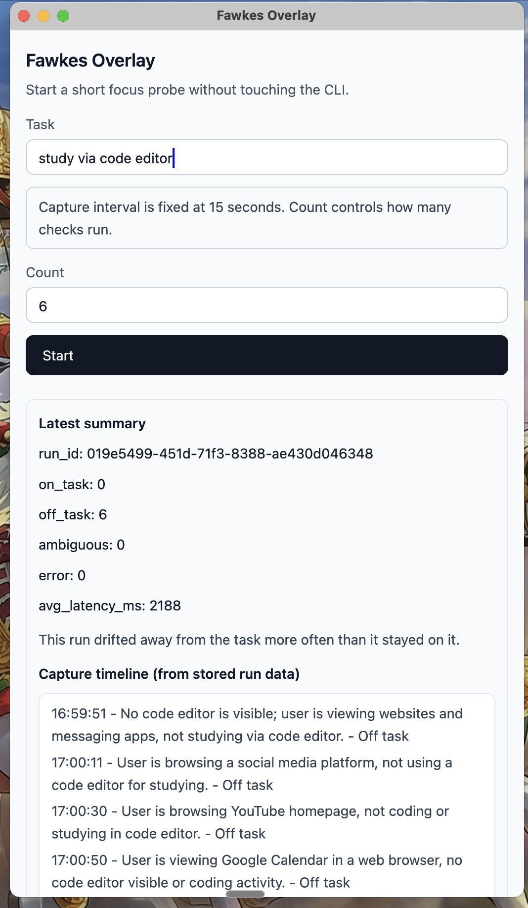

# Fawkes Probe

Fawkes is a Rust prototype for a macOS focus probe: it periodically captures the screen, asks a vision model whether the current activity matches a declared goal, stores the result in SQLite, and shows a short timeline of what happened.



## What Exists Today

- `fawkes-probe`
  A CLI that runs the core capture -> classify -> persist -> summarize loop.
- `fawkes_overlay`
  A minimal native GPUI macOS window for running the probe without touching the CLI.
- `.fawkes_probe/`
  Local runtime storage for SQLite data and downscaled screenshots. This directory is gitignored.

## Current Product Shape

This repo is intentionally still in the proof stage, not the finished product stage.

What the current implementation does:

- captures the full screen on macOS
- downscales each capture and stores it as a JPEG
- classifies each capture against a declared goal using OpenAI vision
- persists each result in SQLite
- shows aggregate counts and a per-capture timeline

What it does not do yet:

- menu bar behavior
- nudges or interventions
- historical dashboards
- Gemini / Vertex provider path
- packaged app distribution

## Binaries

### CLI

The CLI keeps the interval configurable:

```bash
cargo run --bin fawkes-probe -- --goal "study via code editor" --interval 15 --count 6
```

Supported flags:

- `--goal`
- `--interval`
- `--count`
- optional `--model`
- optional `--output-dir`

### Overlay

The overlay is intentionally simpler:

- task input
- count input
- fixed capture cadence of `15 seconds`
- summary panel with:
  - `run_id`
  - `on_task`
  - `off_task`
  - `ambiguous`
  - `error`
  - `avg_latency_ms`
  - per-capture timeline lines in the form `timestamp - description - verdict`

Launch it with:

```bash
cargo run --bin fawkes_overlay
```

## Quick Start

1. Set your OpenAI key:

```bash
export OPENAI_API_KEY="your_key_here"
```

2. Run the overlay:

```bash
cargo run --bin fawkes_overlay
```

3. Or run the CLI directly:

```bash
cargo run --bin fawkes-probe -- --goal "study via code editor" --interval 15 --count 6
```

## Runtime Artifacts

Fawkes stores local runtime data in:

- `.fawkes_probe/fawkes_probe.sqlite`
- `.fawkes_probe/runs/<run_id>/captures/*.jpg`

These are useful for debugging because they let you compare:

- what was on screen
- what the model concluded
- what the final summary said

## Important Truths And Caveats

- This is currently macOS-oriented.
- The current provider path is OpenAI only.
- The overlay can sometimes classify itself or other meta-UI states if the app dominates the screen.
- Saved screenshots are intentionally kept locally right now because they are useful for debugging the classifier.
- The usefulness of a result depends heavily on the declared goal. The same screen can be on-task or off-task depending on what the user said they were trying to do.

## Verification

The current codebase has been verified with:

```bash
cargo fmt --all -- --check
cargo clippy --all-targets --all-features -- -D warnings
cargo test --all-targets --all-features
cargo build --all-targets --all-features
```

## Project Notes

The planning and journey docs live in [docs/prd01](docs/prd01):

- [min01.md](docs/prd01/min01.md)
- [spec01.md](docs/prd01/spec01.md)
- [spec02.md](docs/prd01/spec02.md)
- [journal.md](docs/prd01/journal.md)
- [journey01.md](docs/prd01/journey01.md)
- [journey02.md](docs/prd01/journey02.md)
